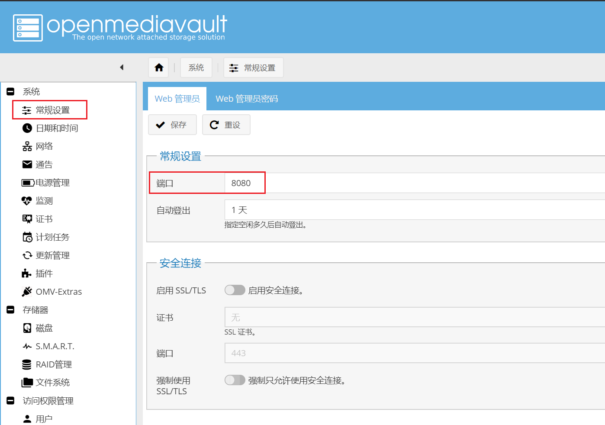
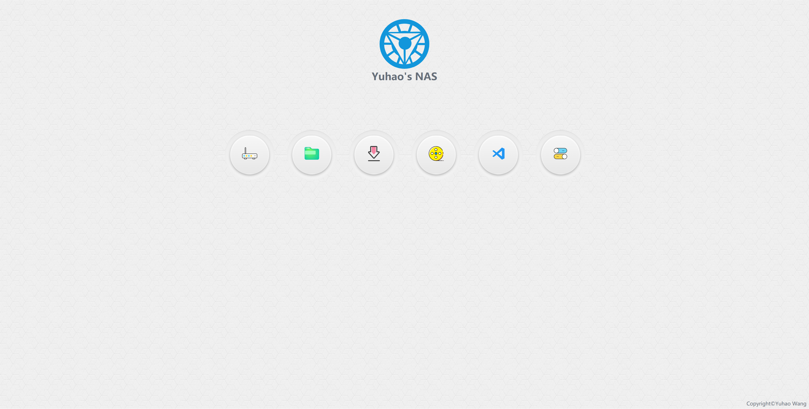

# NAS docker服务合集

## 主要功能

1. nas常用服务合集，docker-compose一键部署。
2. 支持群晖、openmediavault等基于linux的nas系统。
3. 所有服务通过nginx反向代理，方便外网端口映射。

## docker服务

服务名称 | 说明
:-: | :- 
filerun | web文件管理器（网盘）
jellyfin | 媒体中心
qbittorrent | bt下载器
vscode | 代码编辑器

有其他好的功能欢迎提供！

## 配置说明

### .env文件

docker-compose启动时会自动读取同目录下的`.env`文件作为环境变量，`.env`文件中需要填入以下环境变量。这些环境变量是我个人正在使用的配置，有能力的同学建议阅读`docker-compose.yml`和`nginx/nas_index.conf`，如果有额外的需求，请自行修改`.env`文件及`docker-compose.yml`。

名称 | 说明 | 示例
:-: | :- | :-
DOCKER_VOLUME_DIR | docker容器配置文件根目录 | /docker
CLOUD_DATA_DIR | filerun文件目录 | /sharedfolders/data
DOWNLOAD_DIR | 下载目录（qbittorrent） | /sharedfolders/media/downloads
MEDIA_DIR | 媒体存放目录（jellyfin） | /sharedfolders/media
APP_RUN_USER | 容器对挂载目录的权限，用户名 | stark
APP_RUN_USER_ID | 容器对挂载目录的权限，用户ID | 1000
APP_RUN_GROUP | 容器对挂载目录的权限，用户组 | users
APP_RUN_GROUP_ID | 容器对挂载目录的权限，用户组ID | 100
MYSQL_ROOT_PASSWORD | MySQL root用户密码 | password
VSCODE_PASSWORD | vscode登录密码 | password

用户名和用户组及ID通过以下命令获得，不建议使用root用户以及omv admin用户，尽量与拥有smb权限的用户保持一致。

```shell
id username #  username替换为用户名（e.g. id stark）
```

输出uid和gid即user id和group id，对应填入`.env`文件中。

```shell
uid=1000(stark) gid=100(users) groups=100(users)
```

### nginx

nginx在docker-compose.yml中的配置如下

```yaml
  # nginx
  nginx:
    image: nginx:latest
    container_name: nas_nginx
    volumes:
      - ${DOCKER_VOLUME_DIR}/nginx/www:/www # 网站目录
      - ${DOCKER_VOLUME_DIR}/nginx/conf.d:/etc/nginx/conf.d # 配置文件目录
      - ${DOCKER_VOLUME_DIR}/nginx/logs:/var/log/nginx # 日志文件目录
      - /etc/localtime:/etc/localtime:ro # 时间和时区
      - /etc/timezone:/etc/timezone:ro
    networks:
      - nas_net
    restart: unless-stopped
    extra_hosts:
      - "docker.host:${INTERNAL_DOCKER_HOST}" # 获取docker宿主机ip
    ports:
      - "80:80"
```

由于nginx需要占用80端口，所以需要将omv系统默认的管理端口80修改，这里我修改成8080。



群晖默认5000端口不需要修改，但需要在nginx conf文件中修改

```conf
    # omv
    location /omv/ {
        proxy_pass http://docker.host:8080/; # 把这里的8080端口替换
        proxy_set_header Host $host;
        proxy_set_header X-Real-IP $remote_addr;
        proxy_set_header REMOTE-HOST $remote_addr;
        proxy_set_header X-Forwarded-For $proxy_add_x_forwarded_for; 
    }
```

### 导航页



导航页位于./nginx/index/，导航图标包括docker服务以及omv管理页面（以我的nas系统omv为例，可自行修改）、路由管理页面（我的openwrt路由ip是自定义的192.168.88.1，可根据需要修改）。自定义配置过程请参考[今天给NAS整个导航页 - 知乎](https://zhuanlan.zhihu.com/p/98758564)。

### filerun

未完待续